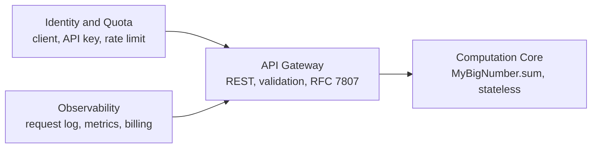

# Thiết kế mở rộng: Từ Core thư viện thành API đông user (Lab 2.3 bản mở rộng)

> Nguyên tắc xuyên suốt: `MyBigNumber.sum` (domain core) KHÔNG đổi.
> Domain ổn định, chỉ adapter phình ra. Mọi mục dưới là quyết định thiết kế.

## 1. Context Map (4 bounded context)

Chiều phụ thuộc một chiều: 3 context ngoài phụ thuộc core; core không biết gì về HTTP, key hay billing.

## 2. Entity và events mới

### Entity

| Entity | Thuộc tính chính | Ghi chú |
|---|---|---|
| `ApiClient` | `id`, `keyHash` (không lưu key thô), `quotaPerMonth`, `ratePerMinute` | Identity của caller |
| `UsageRecord` | `requestId`, `clientId`, `inputDigits`, `durationMs`, `status`, `createdAt` | Một dòng mỗi lượt gọi, nguồn cho billing/abuse |

### Domain events (lần này có thật — phục vụ audit/billing/alert)

| Event | Khi nào | Dữ liệu tối thiểu |
|---|---|---|
| `ComputationRequested` | Request qua validation | `requestId`, `clientId`, `inputDigits` |
| `ComputationCompleted` | Tính xong | `requestId`, `durationMs` |
| `ComputationFailed` | Lỗi validation/hệ thống | `requestId`, `reasonCode` |
| `QuotaExceeded` | Vượt quota/rate | `requestId`, `clientId`, `limit` |

### Request lifecycle (thuộc về API, không thuộc phép tính)

`RECEIVED → VALIDATED → COMPUTED → LOGGED`, nhánh `REJECTED` (422/429).
Phép cộng bên trong vẫn stateless, không trạng thái.

## 3. API contract

- `POST /v1/add` — body `{a: DigitString, b: DigitString}` → `201 {result, requestId}`.
- `422` sai định dạng (kế thừa guard core); `429` hết quota/rate; `401` thiếu/sai API key.
- `GET /v1/usage?client=` — tổng hợp từ `UsageRecord` cho billing.
- Auth: API key qua header. Không bịa field ngoài spec.

## 4. Quyết định NFR

| NFR | Quyết định |
|---|---|
| Scale | Stateless → scale ngang; cấm giữ state trong process |
| Logging | Tắt step-log verbose ở production (display cost O(n²) đã đo ở Lab 2.x); production chỉ log metadata (`UsageRecord`) |
| Abuse | Rate limit N req/phút/client + trần độ dài input (đề xuất 10.000 chữ số, chờ chốt) |
| Secrets | Lưu `keyHash`, key thô chỉ trong vault; rotate định kỳ |
| Perf | Benchmark payload lớn trước khi nhận SLA (pattern đã chứng minh ở core) |

## 5. Open questions (cần PO)

1. Billing theo lượt gọi hay theo số digit?
2. Quota mặc định và giá vượt quota?
3. Mục tiêu SLA/p99 là bao nhiêu?
4. Lưu `UsageRecord` bao lâu, xóa theo chính sách nào?
5. Có cần multi-region / failover không?
6. Trần input 10.000 chữ số có chấp nhận được không?

## 6. Ngoài phạm vi (đợt này)

Số âm, thập phân, BigInt interop, thanh toán trực tuyến, dashboard billing UI.
