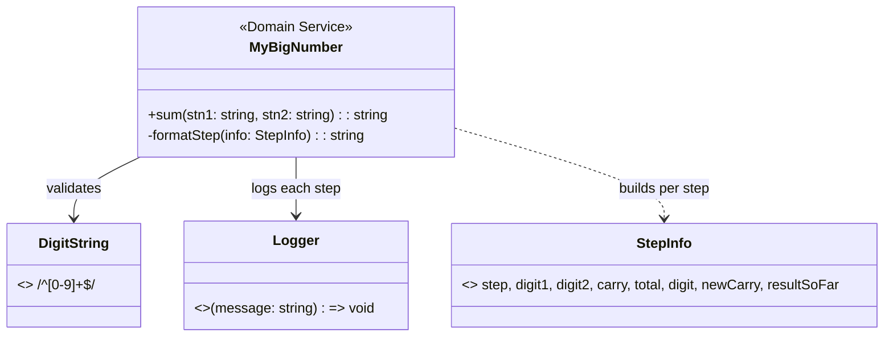

# Domain Model: Cộng số lớn dạng chuỗi (MyBigNumber)

> Tài liệu thiết kế domain cho `MyBigNumber` (TypeScript, stateless library).
> Phương pháp DDD theo Lab 2.3, ánh xạ trung thực vào code hiện có — không bịa thực thể.

## 1. Bối cảnh miền và Bounded Context

- **Bounded Context duy nhất:** `ExactDecimalAddition` — phép cộng thập phân chính xác trên chuỗi chữ số, độ dài tùy ý.
- Context này **không sở hữu** lifecycle, identity hay persistence. Không có khái niệm Equipment/Technician — đó là domain khác (Work Order), không ép vào đây.
- Giao diện với bên ngoài: đúng 1 hàm thuần `sum(stn1, stn2): string` + 1 port diagnostic `Logger`.

## 2. Mục tiêu, phạm vi, giả định

- **Mục tiêu:** mọi phép cộng luôn đúng số học và mọi input sai định dạng bị từ chối loudly.
- **Trong phạm vi:** chuỗi thập phân không dấu, dài tùy ý (đã test 500 chữ số).
- **Ngoài phạm vi:** số âm, thập phân, định dạng locale, BigInt interop.
- **Giả định:** input vừa bộ nhớ (thuật toán O(n) bộ nhớ); chạy đơn luồng đồng bộ.

## 3. Aggregate Root và hành vi (trung thực)

- **Không có Aggregate Root.** Thư viện stateless, không identity, không vòng đời — ép Aggregate vào đây là bịa model.
- Lõi là **Domain Service** `MyBigNumber.sum` + các hành vi: validate → duyệt phải-sang-trái → gom chữ số → chuẩn hóa output.
- Đúng tinh thần Rich Model: không public setter, không trạng thái nửa vời; invariant được thực thi, không chỉ ghi chú.

## 4. Value Objects (không có Entity)

| VO | Invariant | Thực thi |
|---|---|---|
| `DigitString` (input) | `/^[0-9]+$/`, khác rỗng | Guard đầu `sum()`, sai ném `Error` |
| `Digit` | 0–9, `total % 10` | Logic vòng lặp |
| `Carry` | 0 hoặc 1 (`floor(total/10)`, total ≤ 19) | Logic vòng lặp |
| Canonical output | Không có số 0 thừa đầu (`"001"+"002"` → `"3"`) | Strip `^0+(?=[0-9])` trước khi trả |

Không có Entity (không identity cần theo dõi). `Logger` là port diagnostic, `StepInfo` là cấu trúc nội bộ.

## 5. Invariants và business rules

1. Input phải là chuỗi khác rỗng chỉ gồm `0-9`, ngược lại ném `Error` (không trả giá trị ma).
2. Duyệt từ phải sang trái (`length - 1` về `0`), `carry` lan truyền.
3. Output chuẩn hóa: strip số 0 đầu, rỗng → `"0"`.
4. Mỗi bước ghi đúng 1 dòng log qua `Logger` inject (mặc định `console.log`, test truyền noop).
5. Coding rules bổ sung: không khai báo biến trong thân loop; gom chuỗi bằng mảng pre-sized điền theo index, cấm prepend trong loop.

## 6. Domain events

**Không có.** Thư viện stateless không phát sinh event; step-log là diagnostic cho con người đọc, không phải event cho hệ thống khác consume. Ghi rõ để tránh bịa `NumberAdded` events.

## 7. Sơ đồ domain

## 8. Bảng carry (truth table vị trí)

| digit1 + digit2 + carry_in | digit (ghi) | carry_out |
|---|---|---|
| `t ≤ 9` | `t` | 0 |
| `t ≥ 10` (tối đa 9+9+1=19) | `t − 10` | 1 |

Mọi vị trí độc lập nhau ngoài `carry` — đây là toàn bộ "state machine" của domain này.

## 9. Mapping vào cấu trúc TypeScript (thay bảng module Maven của lab)

| Thành phần DDD | File | Ghi chú |
|---|---|---|
| Domain Service + VO enforcement | `src/MyBigNumber.ts` | Thuần, chỉ phụ thuộc `Logger` port |
| Public API | `src/index.ts` | Re-export `MyBigNumber`, `Logger` |
| Demo | `src/demo.ts` | `1234 + 897`, không phải test |
| Tests | `tests/MyBigNumber.test.mjs` | `node:test` trên `dist/`, 10 case |

## 10. Yêu cầu / giả định / câu hỏi mở

### Yêu cầu đã xác định

- Cộng đúng số học mọi độ dài; từ chối input lạ bằng `Error`; log từng bước; test xanh 100%.

### Giả định thiết kế

- Một context, stateless; số không dấu; bộ nhớ đủ chứa input + output O(n).

### Câu hỏi mở

1. Có cần hỗ trợ số âm / thập phân trong tương lai không? (Hiện ngoài phạm vi.)
2. Canonicalization `"0"` cho input toàn số 0 đã đủ, hay cần giữ nguyên định dạng input?
3. Có cần lazy logging (chỉ dựng chuỗi log khi logger dùng tới) cho input siêu lớn không? (Hiện tại display cost gắn với tính năng step-log.)
